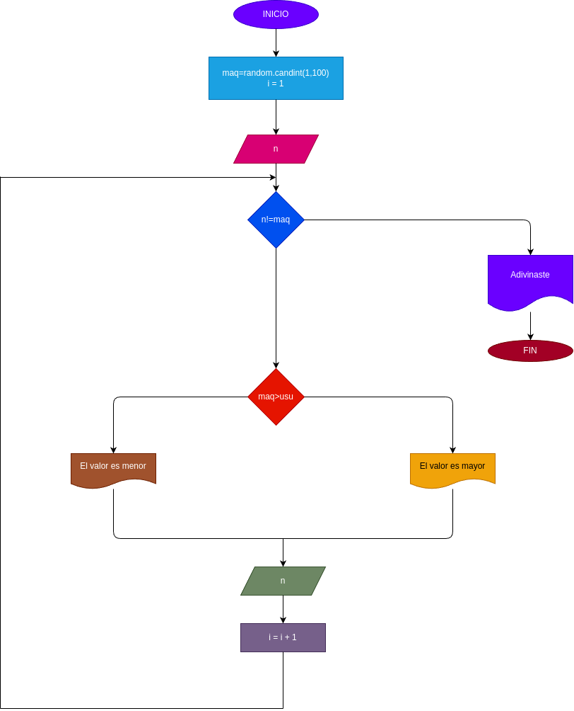

# adivina_el_numero
El programa consiste en que la computadora generara un numero aleatoriamente y que el usuario tendra que adivinar el numero 
 - n= numero que se elije 
 - Maquina = numero random
# Diagrama de flujo
